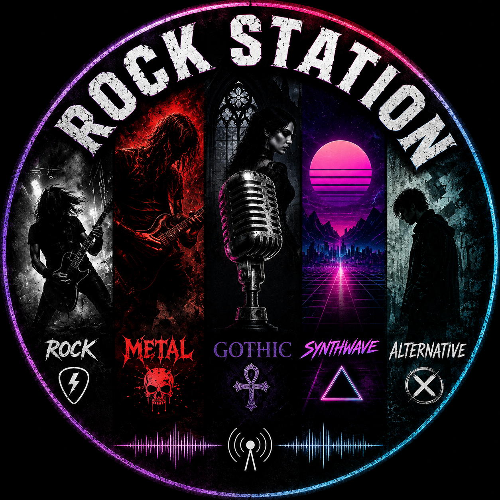

# RockStation



**24/7 free internet rock radio in the browser — no backend, no accounts, no ads.**

RockStation is a static, single-page web app that streams live internet radio across five curated genres. It pulls its station catalog from the free [Radio Browser API](https://api.radio-browser.info) and plays everything directly through the browser's native `<audio>` element. There is no server of any kind — the whole app is HTML, CSS and vanilla JavaScript, deployable to any static host.

---

## Features

### Playback
- Live HTML5 `<audio>` streaming, no plugins
- Play / pause, previous / next station, volume control
- Auto-skip to the next station in the genre if a stream fails to connect (up to 3 attempts before giving up)
- Manual stream URL overrides for stations whose Radio Browser–listed address has gone stale
- The stream is explicitly stopped on `pagehide` so switching apps doesn't leave audio "leaking" after the tab is actually closed

### Genres & stations
- 5 genres: **Rock, Metal, Gothic, Synthwave, Alternative**
- 10 hand-curated stations per genre (50 total, a few overlap across genres), split evenly into two columns flanking the player
- Station lists aren't just "whatever the API returns" — each genre's roster was manually reviewed against the stations' actual tags to filter out mismatched/eclectic results (e.g. a station tagged "metal" among 40 unrelated tags gets excluded in favor of a tighter fit), with a few gaps filled by hand from stations found outside the exact-tag search (sister channels, alternate tags, etc.)
- Per-station manual overrides where needed: corrected display names, replacement logos when the API's favicon 404s or is a generic site icon rather than the station's own, and fixed stream URLs for stations that quietly moved

### Favorites
- Star any station to favorite it; persisted in `localStorage`, no account needed
- Capped at 20 favorites (a deliberate ceiling, not a technical limit)
- The FAVORITES tab shows your saved stations in the same two-column layout as any genre

### Now-playing UI
- Player styled as a phone screen (notch, side buttons, home indicator) framed by the two station columns
- Stays pinned in place (`position: sticky`) while scrolling through a long station list, instead of drifting off-screen
- Animated header equalizer bars for atmosphere
- Country flag (from `flagcdn.com`) and bitrate shown per station, sourced straight from the API response — no unreliable ICY metadata scraping
- Colored-initials fallback avatar for any station without usable art

### Integration
- **Media Session API** — lock-screen and hardware media key support (play/pause/next/previous)
- **Shareable deep links** — `#genre/station-name` in the URL restores the exact genre and station on load, with a one-tap "copy link" button
- Browser tab title updates to the currently playing station

---

## Limitations

- **No backend, so no server-side reliability layer.** Every station is a third-party stream; if a broadcaster's server goes down, that specific station just won't play until it's noticed and either fixed or swapped out. This already happened a few times during development.
- **Station catalog is curated, not live-searchable.** There's no search box or "browse all of Radio Browser" mode — genres are fixed lists that need manual maintenance to stay accurate as stations disappear or drift off-topic.
- **Favorites live in `localStorage` only.** They don't sync across devices or browsers, and clearing site data wipes them.
- **No offline support.** No service worker / caching — an internet connection is required both to load the app and to stream.
- **Autoplay restrictions apply.** Like any web audio, playback only starts after a user gesture (pressing play); it won't auto-start on page load.
- **Dependent on the Radio Browser API's uptime and CORS policy** for fetching each genre's station list on load.

---

## Project structure

```
public/               deployable site root (this is what gets hosted)
  index.html
  style.css
  app.js
  images/
    favicon.png
    hero-image.png / .webp
firebase.json          Firebase Hosting config (serves public/ as the root)
guitar.png             source art, kept for future edits — not used by the app directly
NewTheme.png           source art / repo cover — not used by the app directly
```

## Running locally

```bash
cd public
python -m http.server 8000
```

Then open `http://localhost:8000`.

## Deploying

```bash
firebase deploy
```

Requires the [Firebase CLI](https://firebase.google.com/docs/cli) and a configured Firebase project.
